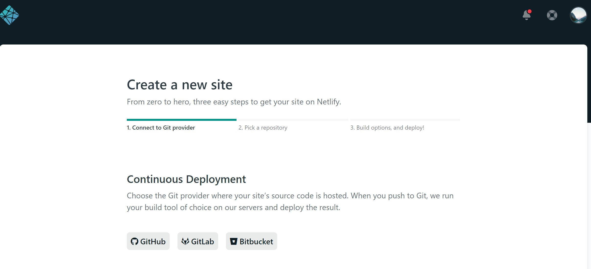

Yep, I start blogging 😊, this is considered big jump for me in terms of my work and life attitude. I have been reluctant to express or share my experience and knowledge online in past 10 years as a developer. I would like to make a bit change. The rest of article will explain how to set up and deploy a simple blog using GatsbyJS and Netlify.

### 🤔 What is GatsbyJS

From [GatsbyJS website](https://www.gatsbyjs.org/)

> Gatsby is a free and open source framework based on React that helps developers build blazing fast **websites** and **apps**

In a nutshell, GatsbyJS is a static site generator based on NodeJS, ReactJS and GraphQL.

### 💻 How to set up

1. Install [NodeJS](https://nodejs.org/) if not yet.

2. Install Gatsby CLI

```shell
npm install -g gatsby-cli
```

3. Create new blog site using gatsby-starter-blog starter

```shell
gatsby new my-blog https://github.com/gatsbyjs/gatsby-starter-blog
```

run below commands and navigate to http://localhost:8000/, you should be able to see default site up and running

```shell
cd my-blog
gatsby develop
```

4. Write a new blog

The project is set up to look for blog posts under the `content/blog` directory. Create a markdown file with `.md` extension and input below content.

```markdown
---
title: My First Post
---

Hi, this is my awesome new blog!
```

### 💫 Deploy to [Netlify](https://www.netlify.com/)

You will need a github repository and Netlify account to complete this step

1. Push your source code to github repository

```shell
git push -u origin master
```

2. Login to Netlify and create a new site, authorize Netlify to access your github repository, just after a few click, your new site is up and online
   
